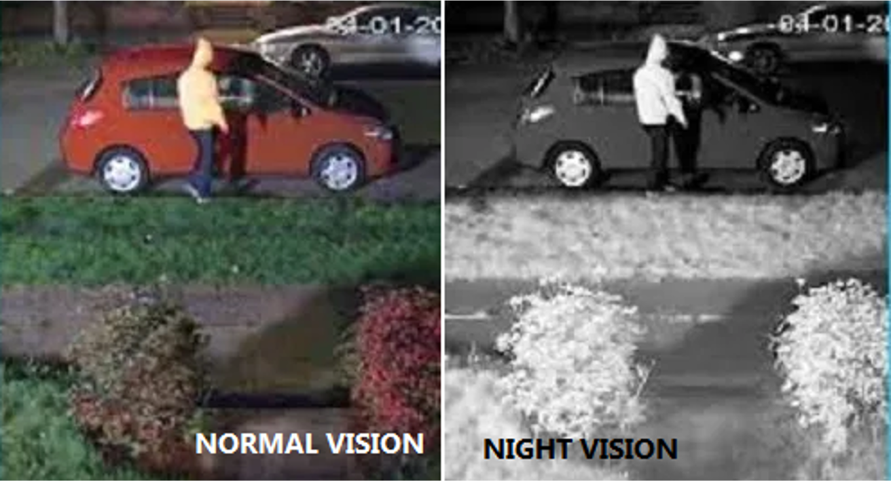
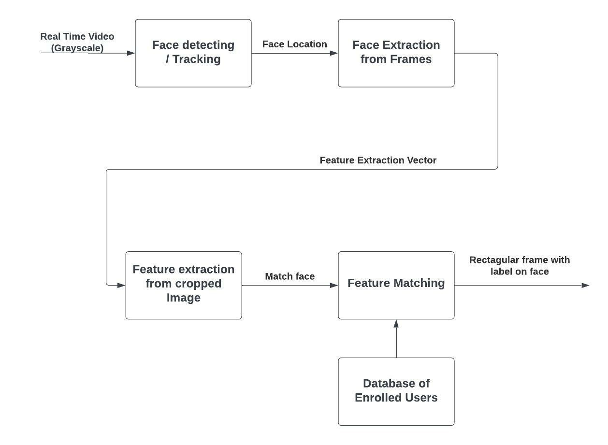
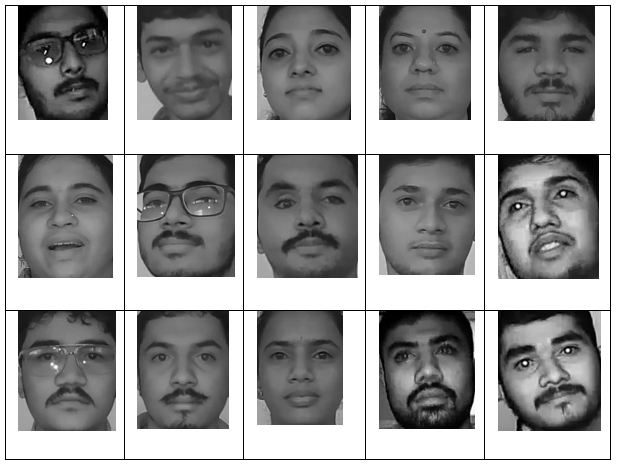
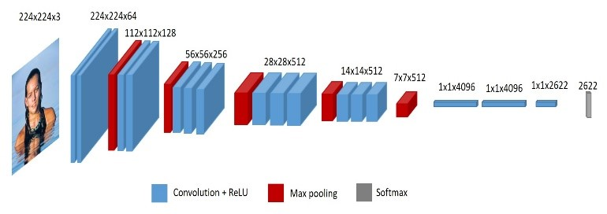
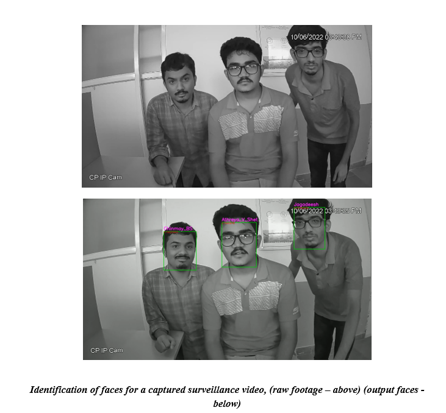
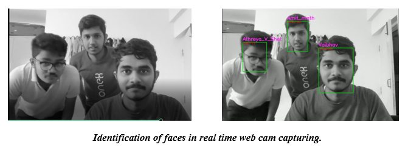

# Face Recognition in Near-Infrared Images.

Face detection and recognition is an extensively researched topic in AI. The use of AI in detection and mapping of faces or any objects can reduce the time spent in video auditing. A face recognition system maps facial traits from a picture or video using biometrics. To identify a match, it compares the data with a database of recognized faces. In any situation, facial recognition technology can intelligently assist in confirming a person's identification. IR camera or night vision in security cameras uses infrared light to capture near-infrared images in the dark and also through fog, dust and smoke, such that camera works in all conditions. Cameras operating in visual spectrum will work well only when the image capturing works well, but IR camera images can capture quality images at all times. The paper presents our work in creating a facial recognition system in near-infrared images from a surveillance camera, in which database was created in live CCTV footage for different individuals and the same was tested with different face detection techniques, classify images using the facial embeddings from VGG-face model to determine the faces.

## IR Cameras

In order to see at night, most CCTV cameras use infrared (IR) technology. CCTV cameras with night vision are surrounded by a number of small LEDs. These emit infrared light at night, which allows the camera to see even in total darkness.

## Methodology

### Steps Followed
 * This Project includes Image capturing, face detection, face recognition. The dataset for training was created from a live CCTV camera with IR enabled, where in a short 10-20s video was captured in low light for every individual in the dataset.
 * Detection of faces in images is done using 3 different techniques, and corresponding bounding box will be drawn around each detected face, and is cropped to box bounded and given for face recognition.
 * In the recognition part we will be using CNN classifier VGG-face, which outputs 2622 embeddings for each face, and a customized softmax regression classifier classifies the images to labels by comparing the known information of given facial embeddings to match the faces [16]. The training for classification model was done using dataset generated. Results and analysis part house the experimental results of our trained model on the trained dataset.

## Dataset Created

Custom dataset for the project was created on 15 different individuals, and the same was used to train the model. The dataset was obtained from the footage obtained from a live IP camera with IR capability (CP-plus 2MP Full HD IR Bullet Camera - 30Mtr). The camera was configured to operate in low light conditions, and short video of 10-15 sec was recorded for each individual. 
Videos were divided into frames of image and for each corresponding frame face detection algorithm was executed. Faces boundary obtained were cropped in a separate image and stored in the respective folder.

## Detection algorithms used
* Haar-cascade module, is available along with the OpenCV module. The detection was carried out using the haar frontal face xml, which draws a square bounding box after finding faces in images, using haar features and selecting best features using Adaboost. 
 
* Yolo-face based on YOLOv3 was derived to improve the performance for face detection. The approach in yolo includes using anchor boxes more appropriate for face detection and a more precise regression loss function. The improved detector significantly increased accuracy while remaining fast detection speed. [8] experimented yolo-face on the WIDER FACE and the FDDB datasets and showed that the improved algorithm outperforms YOLO and its varieties.  

* MTCNN or Multi-Task Cascaded Convolutional Neural Networks composed of three convolutional networks (P-Net, R-Net, and O-net) is very robust and can outperform many face-detection benchmarks but manages to work in real-time. Composed of 3 neural networks, each with multiple layers allows for higher precision [9]. The paper claims 16fps on a 2.60GHz CPU and higher in other higher specification in the mentioned un-optimized MATLAB code. 
     

From the statistics in the figures, we can infer that, accuracy of face detection techniques was comparable between yolo-face and MTCNN, but later one out-classed former in terms of capability to detect faces, where MTCNN was able to detect more frames with faces than yolo-face

## Face Recognition
### VGG-Face Recognition module

 

* VGGFace refers to a series of models developed for face recognition. It was developed by the Visual Geometry Group (hence its VGG name) at the University of Oxford. 
* The models were trained on a dataset comprised mainly of celebrities, public figures, actors, and politicians. Their names were extracted from the Internet Movie Data Base (IMDB) celebrity list based on their gender, popularity, pose, illumination, ethnicity, and profession (actors, athletes, politicians). 

### Using transfer learning to recognize custom faces.
Transfer learning is a machine learning method where a model developed for a task is reused as the starting point for a model on a second task. Transfer learning reduces the amount of time that you need to spend on training.

 

In general CNN, models for image classification can be divided into two parts:
* Feature extraction: the aim of this part is to find the features in the image
* Classification: the aim of this part is to use the various features extracted in the previous part and classify the image to the desired classes. 

## Results

### ScreenShots

 

 
### Sample Video

## References

[1] C. Pasquini, " Near Infrared Spectroscopy: fundamentals, practical aspects and analytical applications.," Journal of the Brazilian Chemical Society. 14. 10.1590/S0103- 50532003000200006. , 2003. 

[2] P. Kaler, "“Study of Grayscale Image in Image Processing”," IJRITCC, vol. 4, no. 11, pp. 309-11, 2016. 

[3] Kumar, Ashu & Kaur, Amandeep & Kumar, Munish. (2019). Face Detection Techniques: A Review. Artificial Intelligence Review. 52. 10.1007/s10462-018-9650-2. 

[4] X. Zhang, M. Peng and T. Chen, "Face recognition from near-infrared images with convolutional neural network," 2016 8th International Conference on Wireless Communications & Signal Processing (WCSP), 2016, pp. 1-5, doi: 10.1109/WCSP.2016.7752592. 

[5] Lin, Yandan & Fotios, Steve. (2013). Investigating methods for measuring face recognition under lamps of different spectral power distribution. Lighting Research and Technology. 47. 10.1177/1477153513505306.

[6] Guo, Kai & Wu, Shuai & Xu, Yong. (2017). Face recognition using both visible light image and near-infrared image and a deep network. CAAI Transactions on Intelligence Technology. 2. 10.1016/j.trit.2017.03.001.

[7] Redmon, Joseph & Farhadi, Ali. (2018). YOLOv3: An Incremental Improvement.

[8] Chen, W., Huang, H., Peng, S. et al. YOLO-face: a real-time face detector. Vis Comput 37, 805–813 (2021). https://doi.org/10.1007/s00371-020-01831-7 

[9] Kaipeng Zhang, Zhanpeng Zhang, Zhifeng Li, Yu Qiao "Joint Face Detection and Alignment Using Multitask Cascaded Convolutional Networks," IEEE Signal Processing Letters, vol. 23, pp. 1499-1503, 2016. 

[10] L. Li, X. Mu, S. Li and H. Peng, "A Review of Face Recognition Technology," in IEEE Access, vol. 8, pp. 139110-139120,2020, doi: 10.1109/ACCESS.2020.3011028. 

